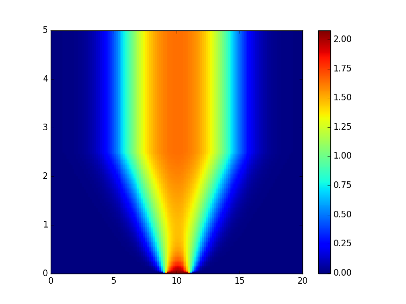
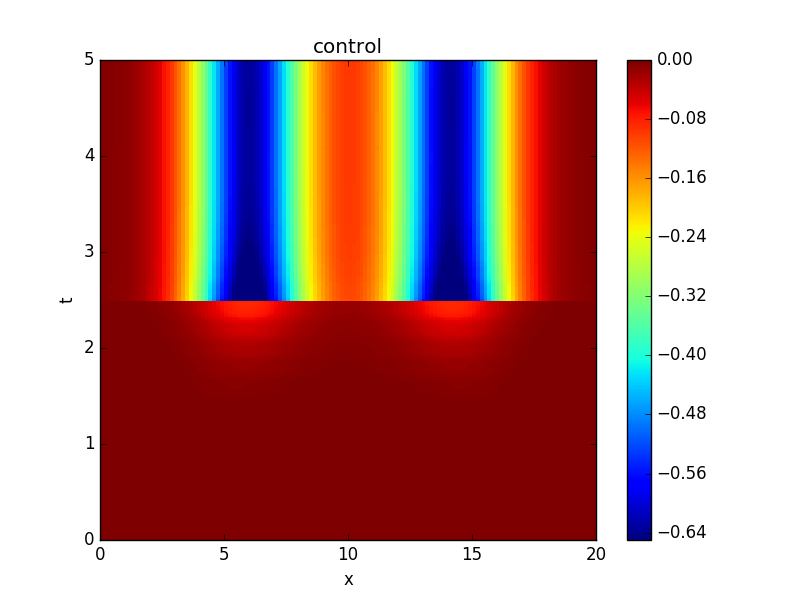

Gradient-based methods for PDE-constrained optmization problems are extremely computationally expensive due to the need to fully solve the forward PDE and an adjoint equation every optimization iteration. We are therefore investigating the use of the PFASST algorithm to parallelize both forward and adjoint solution steps. Since PFASST is iterative, space-time initial conditions for each PDE solve can use the solution from the previous optimization iteration leading to additional computational savings.

<!---  

--->

The figures show the space-time evolution of the solution as well as the optimal control for a prototypical nonlinear reaction-diffusion equation computed with the PFASST algorithm applied to both forward and adjoint solves. Parallizing in time only yield a speedup of 8 on 32 processors, achieving a parallel efficiency of 25% [2,3]. Have a look at reference [1] if you are interested in difficulties and pitfalls related to reporting parallel-in-time results.

Currently we are extending these techniques to hyperbolic equations with applications in inverse problems for tsunami simulations.

## References

[1] S. Götschel, M. L. Minion, D. Ruprecht, R. Speck: Twelve Ways To Fool The Masses When Giving Parallel-In-Time Results, accepted for publication in the PinT 2020 Conference Proceedings, 2021. Available at [https://arxiv.org/abs/2102.11670](https://arxiv.org/abs/2102.11670)

[2] S. Götschel, M. L. Minion: An Efficient Parallel-in-Time Method for Optimization with Parabolic PDEs, SIAM J. Sci. Comput. 41(6):C603-C626, 2019.
Available at [https://epubs.siam.org/doi/abs/10.1137/19M1239313](https://epubs.siam.org/doi/abs/10.1137/19M1239313)

[3] S. Götschel, M. L. Minion: Parallel-in-Time for Parabolic Optimal Control Problems Using PFASST, In: Bjørstad P. et al. (eds) Domain Decomposition Methods in Science and Engineering XXIV. DD 2017. Lecture Notes in Computational Science and Engineering, vol 125., Springer, pp.363-371, 2018.
Available at [hhttps://link.springer.com/chapter/10.1007/978-3-319-93873-8_34](https://link.springer.com/chapter/10.1007/978-3-319-93873-8_34)